# Creating a Crafting Station

## Requirements

- You've done everything in [Getting Started](../../gettingstarted.md) and [Palworld Modding Kit](https://pwmodding.wiki/docs/palworld-modding-kit/install-part-1).

- You've done eveything in [Creating a New Bow](../items/creatingabow.md) to understand dummy assets and how to package your mod.

## Palworld Modding Kit

Go ahead and launch Palworld Modding Kit and we can get started.

### Creating the Blueprint

1. In the Content folder, create the following folder structure: `PSTutorial/MyNewCraftingStation`

2. Right-click on the empty space inside the `MyNewCraftingStation` folder and select `Blueprint Class`.

3. In the "Pick Parent Class" menu, you'll want to search for `PalBuildObject` and select that as the parent class. Name the blueprint `BP_NewCraftingStation`.

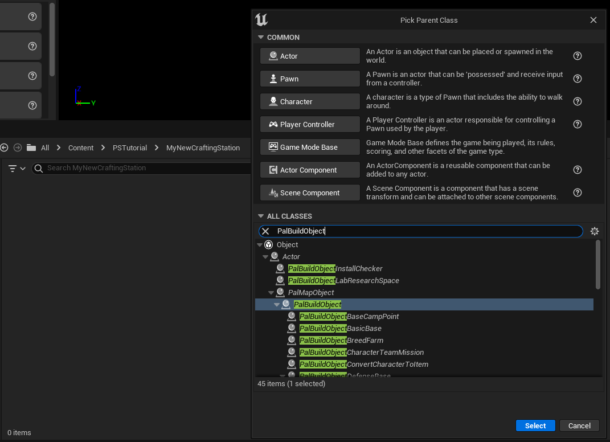

4. Open `BP_NewCraftingStation` and add a few components to this Actor to make sure it doesn't crash when you load it in-game. Add the following Components:

    - `Static Mesh`, name it `StaticMesh`

    - `BP_WorkVisualFX`, name it `BP_WorkVisualFX`

    - `PalWorkFacingComponent`, name it `WorkFacing`

    - `BP_InteractableBox`, name it `BP_InteractableBox`

    - `PalMapObjectItemConverterParameterComponent`, name it `ItemConverterParameter`

    - `Box Collision`, name it `BuildWorkableBounds`

    - `Box Collision`, name it `CheckOverlapCollision`

Your setup should look like the image below, make sure `StaticMesh` is the parent for `BP_WorkVisualFX`, `WorkFacing`, `BP_InteractableBox`, `BuildWorkableBounds` and `CheckOverlapCollision`

    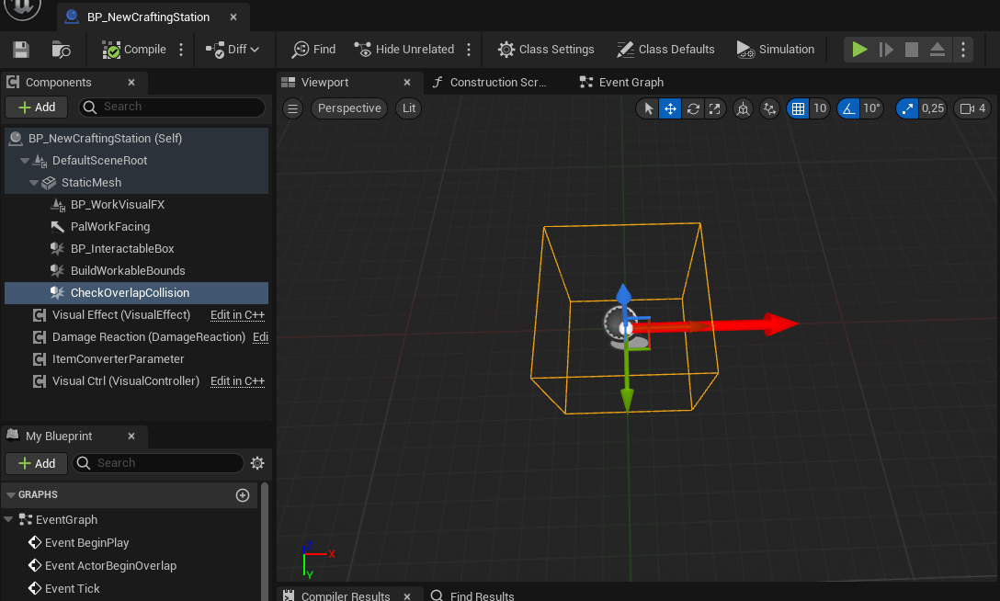

5. Select `BP_NewCraftingStation` in the Component Hierarchy and adjust the following values:

    `Overlap Check Collision Ref` set `Component Name` to `CheckOverlapCollision`

    `ConcreteModelClass` should be set to `PalMapObjectConvertItemModel`

    `DestroyFXType` set this to whatever you'd prefer.

6. Select the `StaticMesh` and change the Static Mesh property to a mesh of your preference or if you don't have a mesh, you can just search for `Cube` instead and use that. If you decide to go the Cube path, then you might notice that there's two of them. You'll want the one which has the path `/Engine/BasicShapes` rather than `/Engine/EngineMeshes`.

    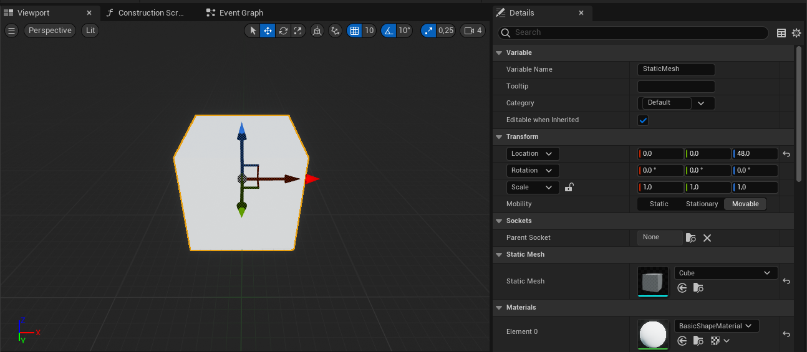

    You might notice that I've set `Z` position on the Static Mesh to 48.0. This is to prevent the Mesh from clipping into the ground when you build it and the amount you need to adjust it depends on the Mesh you're using. I've also set the Material to `BasicShapeMaterial`.

7. Next, adjust the Box Extent on `BP_InteractableBox`, `BuildWorkableBounds` and `CheckOverlapCollision`. This is something you'll have to fine tune yourself, but for this tutorial I've set them to the following XYZ values:

    - `BP_InteractableBox` and `BuildWorkableBounds`: 96.0, 96.0, 96.0

    - `CheckOverlapCollision`: 52.0, 52.0, 52.0

8. Now adjust the Collision Settings for the following Components:

    - **StaticMesh**

        `Collision Presets`: `MapObjectPhysics`
    
        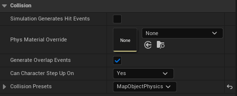

    - **BuildWorkableBounds**

        `Generate Overlap Events`: `Unchecked`

        `Can Character Step Up On`: `No`

        `Collision Presets`: `NoCollision`

        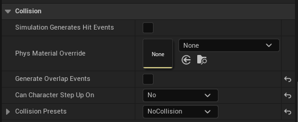

    - **CheckOverlapCollision**

        `Collision Presets`: `BuildingOverlap`

        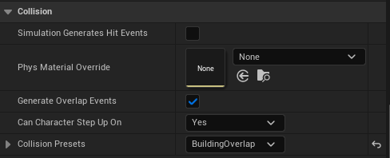

I know it's a lot of components already, but the next step is the final one we need to do in Modding Kit which is `ItemConverterParameter`. This is where we determine what types of items can be crafted at our Crafting Station and the `TargetMaxRank` of the Crafting Station.

The `TargetMaxRank` in `ItemConverterParameter` corresponds to the Rank requirement of items.

9. Adjust `TargetTypesA`, `TargetTypesB` and `TargetMaxRank` under the `PalMapObjectItemConverterParameterComponent` section.

    For the sake of this tutorial, we'll use the same types that the Primitive Workbench has, however you're free to set these to what you want, but keep in mind that including some types might introduce bugs. You can go ahead and copy paste the lines below into their respective properties by right clicking the property name and selecting `Paste`. Make sure to include the ( and ), plus the text inside of it.

    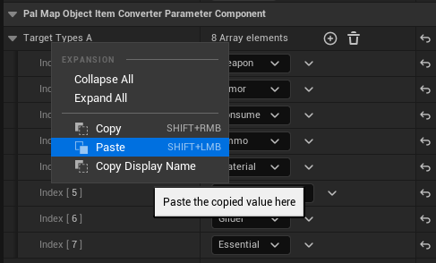

    **TargetTypesA**

    `(Weapon,Armor,Consume,Ammo,Material,SpecialWeapon,Glider)`

    **TargetTypesB**
    
    `(ArmorBody,ArmorHead,SPWeaponCaptureBall,ConsumeBullet,WeaponMelee,WeaponBow,ConsumeOther,MaterialProccessing,Shield,Glider,Essential_UnlockPlayerFuture,WeaponHandgun,WeaponThrowObject,WeaponCrossbow,Essential_AdditionalInventory)`

    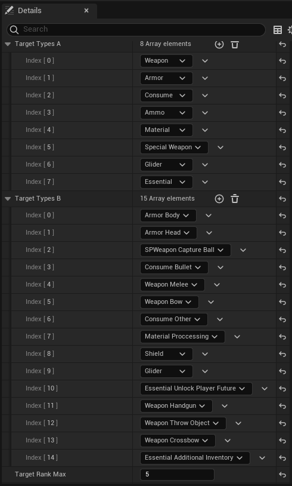

    Set `TargetRankMax` to 5 which is one rank above **Production Assembly Line II**

10. That's everything in Modding Kit! Now you can package the project and we can move into Pal Schema stuff.

## Pal Schema

### Crafting Station

1. Create the following folder structure:

    `NewCraftingStation/buildings/newcraftingstation.json`

    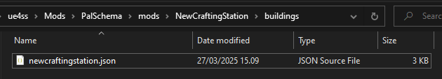

    The `NewCraftingStation` and `newcraftingstation.json` can be called anything, however the `buildings` folder must always be named like this when working with buildings.

2. Open `newcraftingstation.json` and copy-paste the following inside it:

    ```json
    {
        "TUTORIAL_NewCraftingStation": {
            "Name": "Tutorial Workbench",
            "Description": "This is the description that shows up in the Build Wheel.",
            "BlueprintClassName": "BP_NewCraftingStation",
            "BlueprintClassSoft": "/Game/PSTutorial/MyNewCraftingStation/BP_NewCraftingStation.BP_NewCraftingStation_C",
            "IconTexture": "/Game/Pal/Texture/BuildObject/PNG/T_icon_buildObject_WorkBench.T_icon_buildObject_WorkBench",
            "Hp": 2000,
            "Defense": 2,
            "MaterialType": "Wood",
            "MaterialSubType": "Wood",
            "bBelongToBaseCamp": true,
            "DeteriorationDamage": 0.2,
            "BuildingData": {
                "TypeA": "Product",
                "TypeB": "Prod_Craft",
                "Rank": 5,
                "RequiredBuildWorkAmount": 1.0,
                "Material1_Id": "Wood",
                "Material1_Count": 1
            },
            "Assignments": [
                {
                    "WorkSuitability": "Handcraft",
                    "WorkSuitabilityRank": 1,
                    "bPlayerWorkable": true,
                    "bBaseCampWorkerWorkable": true,
                    "WorkType": "CommonTemp",
                    "WorkActionType": "CommonWork",
                    "WorkerMaxNum": 0,
                    "AffectSanityValue": -0.15,
                    "AffectFullStomachValue": 1.0
                }
            ],
            "Technology": {
                "UnlockBuildObjects": [
                    "TUTORIAL_NewCraftingStation"
                ],
                "IconName": "WorkBench",
                "IsBossTechnology": false,
                "Name": "Tutorial Workbench",
                "Description": "This is the description that shows in the Technology tab.",
                "LevelCap": 2,
                "Cost": 1
            }
        }
    }
    ```

    `IconTexture` I'm using the WorkBench icon as I don't have a custom icon, but if you have a custom icon, you can use that instead.

    `MaterialType` and `MaterialSubType` mostly determines damage modifiers.

    `DeteriorationDamage` determines how much damage the building should take each tick when it's not inside Palbox range.

    **BuildingData**

    `TypeA` and `TypeB` most likely determines how the building functions internally, not sure on this one.

    `Rank` is the same thing as `TargetMaxRank` we covered in Step 9 of [Creating the Blueprint](#creating-the-blueprint).

    `RequiredBuildWorkAmount` is the amount of work needed to construct the building fully.

    `Material1_Id` and `Material1_Count` determine the required materials to build the building. You can have up to 4 required materials `Material2_Id`, `Materia2_Count`, etc.

    **Assignments**

    `Assignments` contains an array of assignments for the building. This is typically one per building, but some buildings like farm crops require three. If you look at assignments in `DT_MapObjectAssignData` with FModel, you might notice that they have a certain number after the ID like `_0`. This is important for the assignments to function properly, but Pal Schema handles that for you when working with building mods, so what you see here is enough to make it work.

    **Technology**

    `UnlockBuildObjects` is an array of buildings to unlock with the Technology.

    `IconName` pulls the Icon Texture from `DT_BuildObjectIconDataTable`.

    `IsBossTechnology` determines if it should require Ancient Tech Points to unlock.

    `LevelCap` is the required level for unlocking the Technology.

    `Cost` is the cost in Technology Points.

    Anything else not listed here is either self explanatory or unknown. If you have information regarding the functionality of the unlisted properties, please post in the Palworld Modding discord and I will add them here.

### Test Item and Recipe
Next, we obviously want some way of testing that the new crafting station works as we would expect so we'll create a new item with a Rank of 5.

1. Navigate back to the `NewCraftingStation` folder and create an `items` folder and then a `sword.json` file inside the `items` folder.

2. Open `sword.json` and copy-paste the following inside it:

```json
{
    "Tutorial_Sword_5": {
        "Name": "Legendary Sword",
        "Description": "<itemName id=|Sword|/> for close-range combat.\r\nThe blade is extremely sharp! Mightier than a pen, for sure.\r\nRequires <mapObjectName id=|TUTORIAL_NewCraftingStation|/> to craft.",
        "SneakAttackRate": 1.0,
        "AttackValue": 1000,
        "ID": "Tutorial_Sword_5",
        "IconTexture": "/Game/Others/InventoryItemIcon/Texture/T_itemicon_Weapon_Sword.T_itemicon_Weapon_Sword",
        "Type": "Weapon",
        "TypeA": "Weapon",
        "TypeB": "WeaponMelee",
        "Rarity": 4,
        "Rank": 5,
        "Price": 10440,
        "MaxStackCount": 1,
        "SortID": 140,
        "bNotConsumed": true,
        "actorClass": "/Game/Pal/Blueprint/Weapon/BP_Sword.BP_Sword_C",
        "Weight": 10.0,
        "Durability": 2500.0,
        "Recipe": {
            "Product_Count": 1,
            "WorkAmount": 500.0,
            "Material1_Count": 5,
            "Material1_Id": "Stone"
        }
    }
}
```

We'll be creating a Legendary variant of the Sword that can be crafted only at our new **Tutorial Workbench** since we specified `Rank` of 5 in our Sword's data and our Workbench allows crafting items with a Rank of 5 or lower.

Notice the `<mapObjectName id=|TUTORIAL_NewCraftingStation|/>`, the game's tooltip system will automatically grab the appropriate localization for our Workbench and it should display "Tutorial Workbench" in the description of our Sword.

3. That's everything, you can now load your game and you should see results similar to the images below!

### Final Result

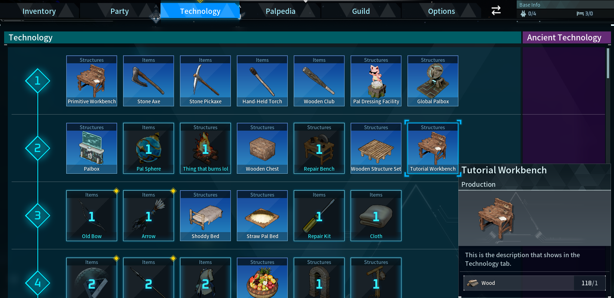

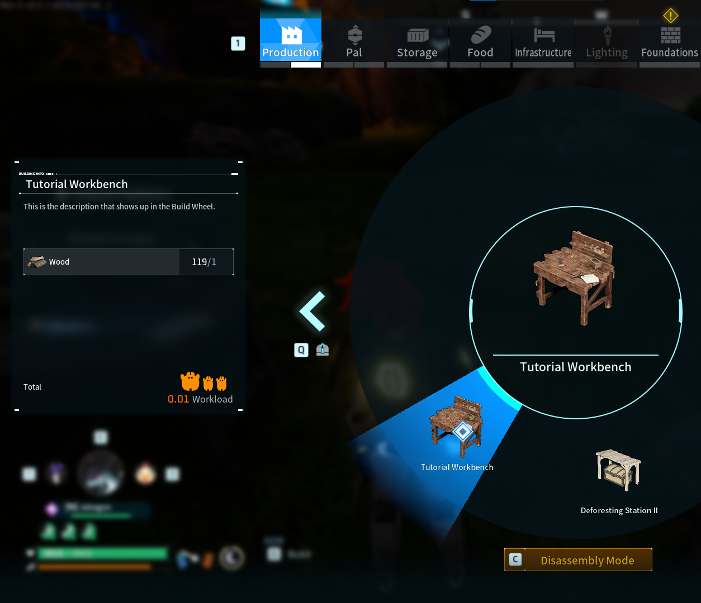

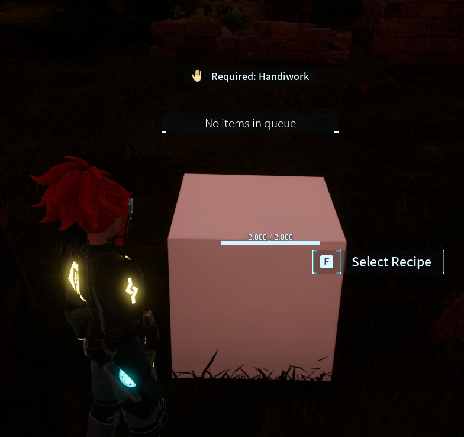

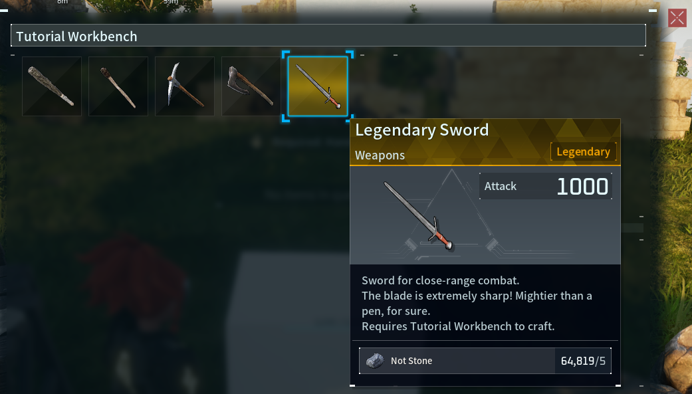