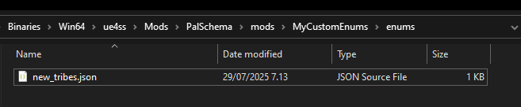
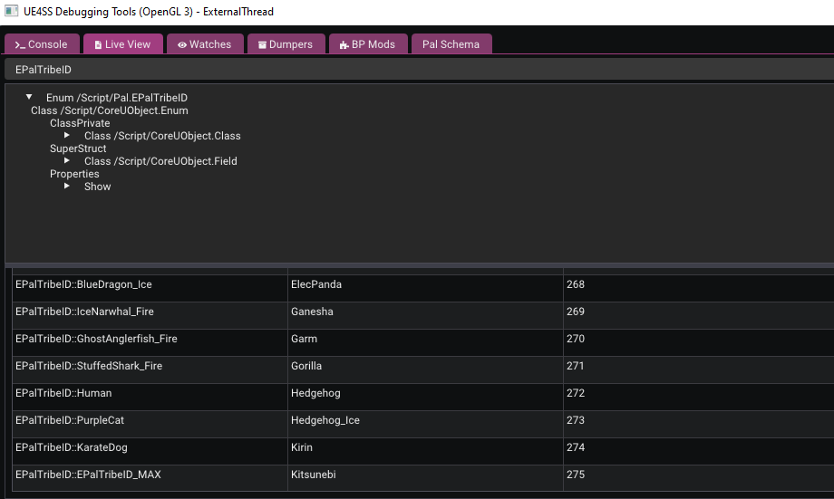

# Adding New Enums

So in case you've been working with adding custom Pals, you'll immediately notice that the `Tribe` property becomes pretty important. With 0.4 adding Enum support, it's now possible to create new tribes and we'll go through the basics of adding new enums.

## Setting up your Project

1. You'll want to create your mod folder, for this tutorial let's just call it `MyCustomEnums`.

2. Create another folder called `enums` inside `MyCustomEnums`. It's very important to call the sub folder `enums` because this is where PalSchema will look for any custom enums.

3. Next, let's create a json file inside our `enums` folder. You can call the .json file whatever you want, I decided to call mine `new_tribes.json`.



4. Open the `new_tribes.json` file and add the following inside of it:

```json
{
    "EPalTribeID": [
        "PurpleCat",
        "KarateDog"
    ]
}
```

Let's break the above into parts:
- `EPalTribeID` is the Enum we want to target.
- You must then provide an array of strings which are the new Enum values you want to add, in this case to `EPalTribeID`.
- You must make sure to not include the namespace in the value, so make sure you don't do something like `EPalTribeID::PurpleCat`. Just do `PurpleCat`.

## Confirming in Live View

You can confirm the addition of your new values by starting up Palworld with UE4SS' LiveView enabled and searching for `EPalTribeID` in the Live View tab and then clicking on the EPalTribeID that popped up during search. Introduction to Live View can be found on the [UE4SS docs](https://docs.ue4ss.com/dev/feature-overview/live-view.html).



## Using your Custom Enums

To use your newly added enums, you just reference them like you would do it normally. We'll assume we have our custom pal created in the pals folder with the following in it:

```json
{
    "PurpleCat": {
        "Tribe": "EPalTribeID::PurpleCat"
    },
    "KarateDog": {
        "Tribe": "EPalTribeID::KarateDog"
    }
}
```

And there you have it! You can do this with any native Enum. You can differentiate by checking if the Enum starts with /Game/, this means that it's a User Defined Enum which is a blueprint asset basically. Native Enums start with /Script/.

Do note that having the ability to create Enums is very powerful and is not only limited to custom pals.