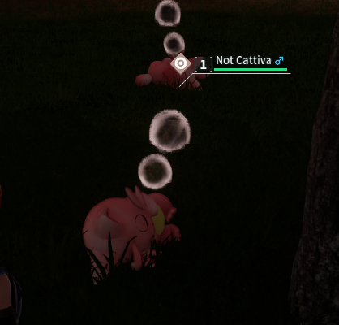
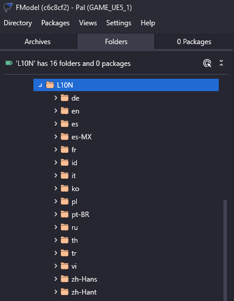

# Intro to Translations

Hello there! So you're interested in creating new localization entries for the game? You've come to the right place!

With PalSchema you can also support languages that aren't normally supported by the game.

## Setup

1. First, let's create a new mod folder called `MyTranslation`.

2. Inside `MyTranslation`, you'll want to create another folder called `translations`. This folder **must** be called `translations` so it can be recognized by PalSchema.

## Language Codes

Before we get back to our mod, we'll have to first understand what a 'language code' is. Language code is basically abbreviations that represent different languages like `en` for English for example. This is something commonly used in computing context for translation related stuff.

PalSchema utilizes ISO 639 two-letter codes to determine which language it should be using, just like Unreal Engine does. You can check all the available language codes over here https://en.wikipedia.org/wiki/List_of_ISO_639_language_codes

For now, let's just use `en`, so English. However you're welcome to try different languages.

## Creating the Localization Folder(s)

1. In the [Setup](#setup) section, the last thing we did was creating a `translations` folder, we'll want to create a folder called `en` inside the `translations` folder which means we'll be altering or creating translations for the English localization.

2. Inside the `en` folder, create a new file called `example_translation.json`.

3. Open `example_translation.json` and write this inside of it:

```json
{
    "DT_PalNameText": {
        "PAL_NAME_PinkCat": "Not Cattiva"
    }
}
```

`DT_PalNameText` is where the names of all Pals are stored and you might notice that it has this weird prefix `PAL_NAME_`. This is different for each localization file and is necessary to make sure the game actually reads these entries. We'll be modifying the name of Cattiva in the above example.

4. Now we can launch the game and check if our changes took effect!



Success!

## Going Further

Now that you have the basic understanding of translation mods, you'll be able to create and modify localizations for anything in the game. I recommend using FModel and exploring the localization files which can be found in `Pal/Content/L10N`.

